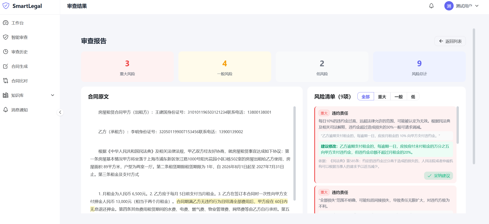
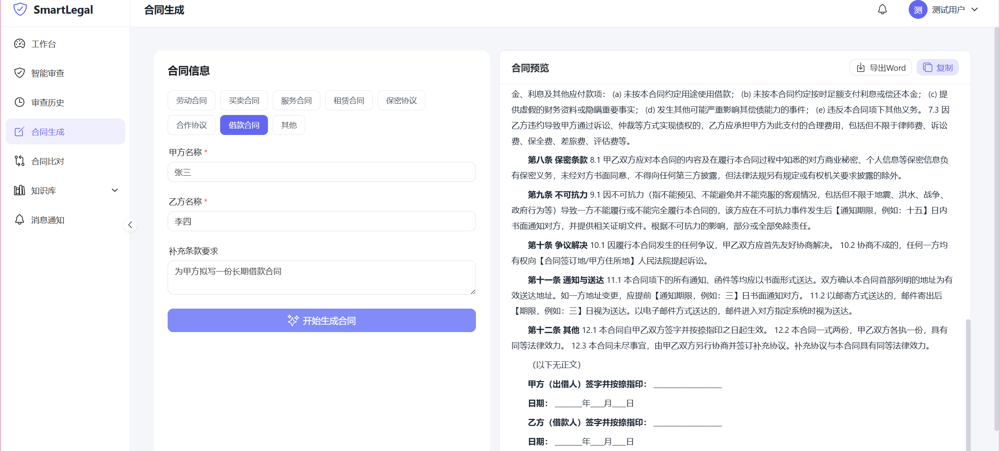
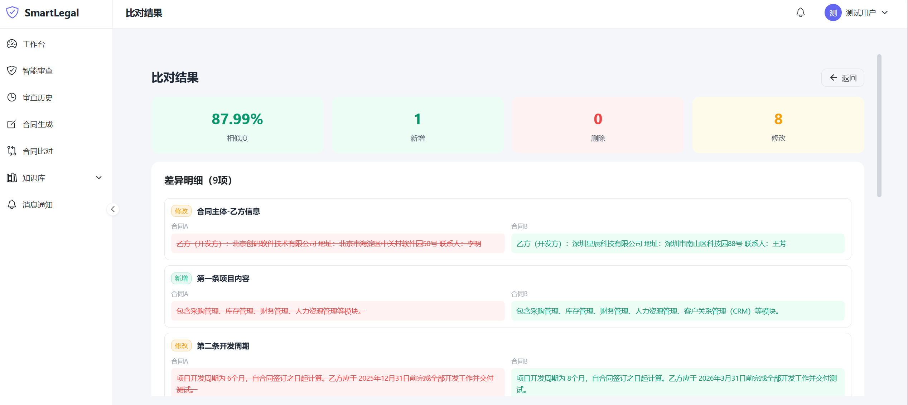
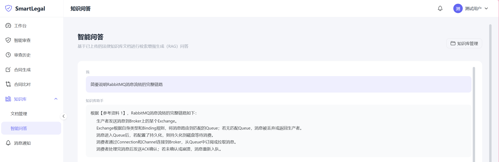

# SmartLegal - 智能法律合同审查与生成系统

基于 AI 大语言模型的法律合同智能处理平台，支持合同审查、AI 生成、差异比对、RAG 知识库问答。

## 核心功能

| 功能 | 说明 |
|------|------|
| **智能审查** | 上传 PDF/Word，AI 识别法律风险，按重大/一般/低三级分类标注位置并给出修改建议 |
| **合同生成** | 填写合同信息（类型、甲乙双方、金额条款），AI 流式实时生成专业合同，支持导出 Word |
| **合同比对** | 上传两份 PDF/Word，AI 识别新增/删除/修改内容，计算相似度 |
| **知识库问答** | 上传法律文档构建知识库，基于 ChromaDB + RAG 实现检索增强问答，SSE 流式输出 |

## 功能演示





## 技术架构

```
┌─────────────────────────────────────────────────────┐
│                    Vue3 前端 (5173)                    │
│             Naive UI + Pinia + TypeScript             │
└─────────────────────┬───────────────────────────────┘
                      │ HTTP/SSE
┌─────────────────────▼───────────────────────────────┐
│               Spring Boot 后端 (8080)                  │
│         MyBatis Plus + JWT Security + WebClient       │
└─────────────────────┬───────────────────────────────┘
                      │ REST
┌─────────────────────▼───────────────────────────────┐
│              FastAPI AI 引擎 (8000)                    │
│    LLM Client + RAG Pipeline + Document Parser        │
└──────────┬────────────────────┬──────────────────────┘
           │                    │
    ┌──────▼──────┐    ┌───────▼────────┐
    │   DeepSeek   │    │  ChromaDB      │
    │  (LLM 模型)  │    │  (向量数据库)   │
    └─────────────┘    └────────────────┘
```

| 层级 | 技术栈 |
|------|--------|
| 前端 | Vue 3 + Pinia + Naive UI + TypeScript + Vite |
| 后端 | Spring Boot 3 + MyBatis Plus + Spring Security + JWT |
| AI 引擎 | FastAPI + OpenAI SDK + LangChain Text Splitters |
| LLM | DeepSeek（可替换任何 OpenAI 兼容模型） |
| 向量库 | ChromaDB（内置 bigram 哈希嵌入，零外部依赖） |
| 数据库 | MySQL 8 |
| 文档解析 | PyMuPDF + python-docx |

## 项目结构

```
smartLegal-v1/
├── frontend/               # Vue3 前端
│   └── src/
│       ├── api/            # API 层（axios + SSE）
│       ├── components/     # 通用组件
│       ├── layouts/        # 布局（顶部导航）
│       ├── router/         # 路由配置
│       ├── stores/         # Pinia 状态管理
│       ├── types/          # TypeScript 类型
│       ├── utils/          # 工具函数
│       └── views/          # 页面视图
│           ├── auth/       # 登录/注册
│           ├── dashboard/  # 工作台
│           ├── review/     # 智能审查
│           ├── generation/ # 合同生成
│           ├── comparison/ # 合同比对
│           ├── knowledge/  # 知识库
│           └── notifications/ # 通知
├── backend/                # Spring Boot 后端
│   └── src/main/java/com/smartlegal/
│       ├── common/         # 公共类（Result、异常处理）
│       ├── config/         # 配置（Security、CORS、MyBatis）
│       ├── controller/     # REST 控制器
│       ├── dto/            # 请求 DTO
│       ├── entity/         # 数据库实体
│       ├── mapper/         # MyBatis Mapper
│       ├── security/       # JWT 认证
│       ├── service/        # 业务服务
│       └── vo/             # 响应 VO
├── ai-agent/               # FastAPI AI 服务
│   └── app/
│       ├── api/            # API 路由
│       ├── models/         # Pydantic 模型
│       ├── parsers/        # 文档解析（PDF/Word）
│       ├── rag/            # RAG 流水线
│       │   ├── document_loader.py
│       │   ├── text_splitter.py
│       │   ├── embeddings.py
│       │   ├── vector_store.py
│       │   └── retriever.py
│       ├── services/       # AI 业务服务
│       │   ├── llm_client.py          # LLM 调用封装
│       │   ├── review_service.py     # 合同审查
│       │   ├── generation_service.py # 合同生成
│       │   ├── comparison_service.py # 合同比对
│       │   └── knowledge_service.py  # 知识库问答
│       └── utils/          # 提示词模板、导出工具
├── docker/                 # Docker Compose（MySQL + Redis）
├── docs/sql/               # 数据库初始化脚本
├── .env.example            # 环境变量模板
└── .gitignore
```

## 快速启动

### 环境要求

- Java 17+
- Python 3.11+
- Node.js 18+
- MySQL 8.0

### 1. 数据库初始化

```bash
mysql -u root -p < docs/sql/init.sql
```

### 2. 配置 AI 服务

```bash
cd ai-agent
cp ../.env.example .env
# 编辑 .env，填入 DEEPSEEK_API_KEY
pip install -r requirements.txt
python -m app.main    # 启动在 8000 端口
```

### 3. 启动后端

```bash
cd backend
# 确认 application-dev.yml 中数据库连接信息正确
mvn spring-boot:run    # 启动在 8080 端口
```

### 5. 启动前端

```bash
cd frontend
npm install
npm run dev            # 启动在 5173 端口
```

访问 `http://localhost:5173`，默认账号 `admin` / `123456` 或 `user` / `123456`。

## 切换 LLM 模型

项目使用 OpenAI 兼容 SDK，在 `.env` 中修改变量即可切换：

```env
# OpenAI
DEEPSEEK_API_KEY=sk-xxx
DEEPSEEK_BASE_URL=https://api.openai.com/v1
DEEPSEEK_MODEL=gpt-4o

# 通义千问
DEEPSEEK_BASE_URL=https://dashscope.aliyuncs.com/compatible-mode/v1
DEEPSEEK_MODEL=qwen-plus

# 本地 Ollama
DEEPSEEK_BASE_URL=http://localhost:11434/v1
DEEPSEEK_MODEL=qwen2.5:7b

# 智谱 GLM
DEEPSEEK_BASE_URL=https://open.bigmodel.cn/api/paas/v4
DEEPSEEK_MODEL=glm-4
```

RAG 嵌入使用内置 bigram 哈希算法，无需额外安装模型或 API。

## API 文档

后端启动后访问：`http://localhost:8080/doc.html`

主要接口分组：

| 分组 | 路径前缀 |
|------|----------|
| 认证 | `/api/v1/auth/` |
| 智能审查 | `/api/v1/reviews/` |
| 合同生成 | `/api/v1/generation/` |
| 合同比对 | `/api/v1/comparisons/` |
| 知识库 | `/api/v1/knowledge/` |
| 通知 | `/api/v1/notifications/` |

## 许可证

MIT License

## 免责声明

本项目仅供学习和研究使用。AI 生成的合同和审查结果仅供参考，不构成正式法律意见。具体法律事务请咨询执业律师。
